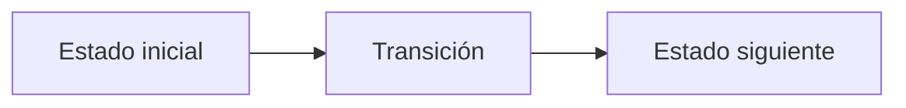

# A. Avatar queries

**Autor:** [Autor del problema]

**Link:** [A. Avatar queries](https://codeforces.com/gym/106710/problem/A)

**Tiempo límite:** 1 s

**Memoria límite:** 256 MB

## Description

Avatar aang is in trouble. He's facing a threat bigger than anything he has faced before and he needs the help of former avatars. However talking with his pasts lives, is exhausting so he wants your help to find the correct avatars to contact.

You are given an array $a_1,a_2,\ldots,a_n$ where $a_i$ is how helpful the $i$-th avatar is, and $a_n$ avatar is the latest avatar before Aang. Consider that an avatar could be unhelpful rather than helpful, so he'll have a negative value.

You'll have to answer $q$ queries, consisting of a number $x$ indicating, Aang doesn't want to go further back than the $x$-th avatar. So starting from avatar $x+1$, find the maximum possible sum of helpfuness a contiguous subarray of avatars can give. Tradition indicates that Aang must recieve help from at least 1 avatar.

## Input

The first line contains two integers $n$ and $q$ ($1 \le n,q \le 2\cdot 10^5$).

The second line contains $n$ integers $a_1,a_2,\ldots,a_n$ ($-10^9 \le a_i \le 10^9$).

Each of the next $q$ lines contains one integer $x$ ($0 \le x \lt n$).

## Output

For each query, print the maximum help Aang can get, even if it is negative.

## Examples

### Example 1

#### Input

```text
5 4
-2 3 -1 4 -5
0
1
3
4
```

#### Output

```text
6
6
4
-5
```

## Notes

For $x=0$, all avatars are available. For $x=n-1$, the only available avatar is $a_n$.

## Temas identificados

### Programación

- [Técnica o algoritmo]

### Matemáticas

- [Concepto matemático, si aplica]

## Propuesta de solución

**Autor de la propuesta:** [Autor de la propuesta]

Explica cómo modelar el problema y por qué la estrategia funciona.

## Observaciones

- [Observación clave del problema]

## Restricciones

[Relaciona los límites de entrada con la complejidad necesaria y justifica las
estructuras de datos elegidas.]

## Estados o estructura de la solución

[Define los estados, variables o estructuras principales. Si es programación
dinámica, explica qué representa cada estado y sus transiciones.]


## Casos base

[Indica los casos base y explica por qué son correctos.]

## Transiciones o algoritmo

[Explica paso a paso la transición entre estados o el algoritmo general.]



## Correctitud

[Argumenta por qué el algoritmo genera todas las soluciones válidas y no
cuenta ninguna solución más de una vez.]

## Complejidad computacional

- Tiempo: $O(?)$
- Memoria: $O(?)$

## Implementación

### C++

**Autor de la implementación:** [Autor de la implementación]

```cpp
// Código de la solución.
```

## Casos límite

- [Caso límite y resultado esperado]
- [Caso límite relacionado con las restricciones]
