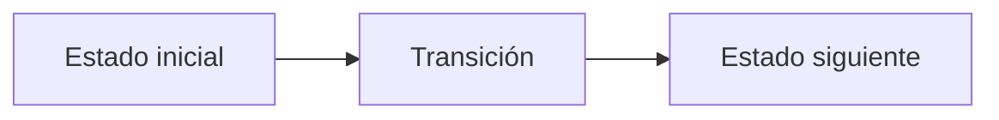

# B. Bridges of Koninsberg ii

**Autor:** [Autor del problema]

**Link:** [B. Bridges of Koninsberg ii](https://codeforces.com/gym/106710/problem/B)

**Tiempo límite:** 4 s

**Memoria límite:** 256 MB

## Description

The kingdom has $n$ cities. Travel is represented by a directed cost matrix $M$: if $M[i][j]=-1$, travelling directly from city $i$ to city $j$ is impossible; otherwise $M[i][j]$ is its non-negative toll. The matrix need not be symmetric. Also, $M[i][i]=0$.

Then $m$ meteor updates occur. An update gives two cells $(i,j)$ and $(x,y)$ and an increment $k$. It adds $k$ to every existing off-diagonal entry in the axis-aligned rectangle whose row range is $[\min(i,x),\max(i,x)]$ and column range is $[\min(j,y),\max(j,y)]$. Entries equal to $-1$ remain $-1$, and diagonal entries remain $0$.

After all updates, answer $q$ minimum-cost directed-path queries. For each pair $(a,b)$, output the minimum total toll from $a$ to $b$, or $-1$ if no directed path exists.

## Input

The first line contains $n$ ($1 \le n \le 750$). Each of the next $n$ lines contains $n$ integers $M[i][j]$ ($-1 \le M[i][j] \le 10^6$). The diagonal entries are $0$; $-1$ denotes no directed edge.

The next line contains $m$ ($0 \le m \le 10^5$). Each of the next $m$ lines contains $i,j,x,y,k$ ($1 \le i,j,x,y \le n$, $0 \le k \le 10^9$), describing an update as above.

The next line contains $q$ ($1 \le q \le 10^5$). Each of the next $q$ lines contains $a,b$ ($1 \le a,b \le n$).

## Output

Print $q$ lines. The $t$-th line must contain the minimum cost of a directed path for the $t$-th query after all updates, or $-1$ if no such path exists.

## Examples

### Example 1

#### Input

```text
3
0 2 -1
2 0 4
-1 1 0
1
1 1 2 2 3
3
1 2
2 3
1 3
```

#### Output

```text
5
4
9
```

## Notes

Updates affect matrix entries, not already-computed shortest paths. A missing edge ($-1$) is never created by an update. A query from a city to itself has answer $0$. All final answers fit in a signed 64-bit integer.

## Temas identificados

### Programación

- [Técnica o algoritmo]

### Matemáticas

- [Concepto matemático, si aplica]

## Propuesta de solución

**Autor de la propuesta:** [Autor de la propuesta]

Explica cómo modelar el problema y por qué la estrategia funciona.

## Observaciones

- [Observación clave del problema]

## Restricciones

[Relaciona los límites de entrada con la complejidad necesaria y justifica las
estructuras de datos elegidas.]

## Estados o estructura de la solución

[Define los estados, variables o estructuras principales. Si es programación
dinámica, explica qué representa cada estado y sus transiciones.]


## Casos base

[Indica los casos base y explica por qué son correctos.]

## Transiciones o algoritmo

[Explica paso a paso la transición entre estados o el algoritmo general.]



## Correctitud

[Argumenta por qué el algoritmo genera todas las soluciones válidas y no
cuenta ninguna solución más de una vez.]

## Complejidad computacional

- Tiempo: $O(?)$
- Memoria: $O(?)$

## Implementación

### C++

**Autor de la implementación:** [Autor de la implementación]

```cpp
// Código de la solución.
```

## Casos límite

- [Caso límite y resultado esperado]
- [Caso límite relacionado con las restricciones]
