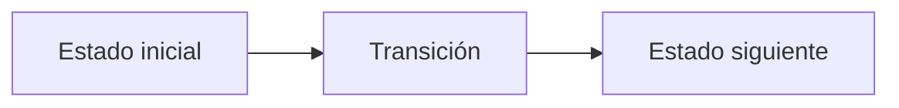

# C. Costly Roads

**Autor:** [Autor del problema]

**Link:** [C. Costly Roads](https://codeforces.com/gym/106710/problem/C)

**Tiempo límite:** 1 s

**Memoria límite:** 256 MB

## Description

There are $n$ vertices connected by $n-1$ roads. Ignoring direction, the roads form a tree.

For every road, traveling in its two directions may have different costs. An input line $u\ v\ a\ b$ means that traveling from $u$ to $v$ costs $a$, while traveling from $v$ to $u$ costs $b$.

For every possible starting vertex $r$, find the sum of the costs of the unique directed trips from $r$ to all vertices. The trip from $r$ to itself has cost zero.

## Input

The first line contains an integer $n$ ($1 \le n \le 2\cdot10^5$).

Each of the next $n-1$ lines contains four integers $u$, $v$, $a$, and $b$ ($1 \le u,v \le n$, $u \ne v$, $1 \le a,b \le 10^6$). The undirected edges $(u,v)$ form a tree. The costs of directions $u\to v$ and $v\to u$ are $a$ and $b$, respectively.

## Output

Print $n$ integers. The $r$-th integer must be the sum of travel costs from vertex $r$ to every vertex.

## Examples

### Example 1

#### Input

```text
1
```

#### Output

```text
0
```

### Example 2

#### Input

```text
3
1 2 4 7
2 3 2 5
```

#### Output

```text
10 9 17
```

### Example 3

#### Input

```text
4
2 1 3 8
2 3 4 6
4 2 5 2
```

#### Output

```text
30 9 23 22
```

## Notes

All required sums fit in signed 64-bit integers.

## Temas identificados

### Programación

- [Técnica o algoritmo]

### Matemáticas

- [Concepto matemático, si aplica]

## Propuesta de solución

**Autor de la propuesta:** [Autor de la propuesta]

Explica cómo modelar el problema y por qué la estrategia funciona.

## Observaciones

- [Observación clave del problema]

## Restricciones

[Relaciona los límites de entrada con la complejidad necesaria y justifica las
estructuras de datos elegidas.]

## Estados o estructura de la solución

[Define los estados, variables o estructuras principales. Si es programación
dinámica, explica qué representa cada estado y sus transiciones.]


## Casos base

[Indica los casos base y explica por qué son correctos.]

## Transiciones o algoritmo

[Explica paso a paso la transición entre estados o el algoritmo general.]



## Correctitud

[Argumenta por qué el algoritmo genera todas las soluciones válidas y no
cuenta ninguna solución más de una vez.]

## Complejidad computacional

- Tiempo: $O(?)$
- Memoria: $O(?)$

## Implementación

### C++

**Autor de la implementación:** [Autor de la implementación]

```cpp
// Código de la solución.
```

## Casos límite

- [Caso límite y resultado esperado]
- [Caso límite relacionado con las restricciones]
