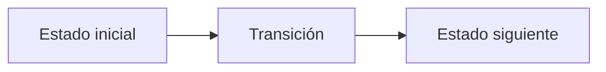

# D. Disco Elysium

**Autor:** [Autor del problema]

**Link:** [D. Disco Elysium](https://codeforces.com/gym/106710/problem/D)

**Tiempo límite:** 1 s

**Memoria límite:** 256 MB

## Description

Revachol, Jamrock, Precinct 41. The body still hangs behind the Whirling-in-Rags, and the RCM demands paperwork.

Your evidence ledger has $N$ entries, each stamped with a non-negative case number. Logic points out the obvious: the Coalition's clerks do not read your report — they only measure its Completeness Index, defined as the smallest non-negative integer that does not appear among the case numbers in the ledger. The higher the index, the more thorough you appear.

Inland Empire whispers that ink is negotiable. You may overwrite the case number of at most $K$ entries, replacing each with any non-negative integer you like. You cannot add entries and you cannot tear any out — Kim would notice.

Determine the maximum Completeness Index your ledger can attain.

## Input

The first line contains two integers $N$ and $K$ $(1 \le N \le 2 \cdot 10^5$, $0 \le K \le N)$ — the number of entries in the ledger and the number of entries you may overwrite.

The second line contains $N$ integers $a_1, a_2, \ldots, a_N$ $(0 \le a_i \le 10^9)$, where $a_i$ is the case number stamped on the $i$-th entry.

## Output

Print a single integer: the maximum Completeness Index achievable by overwriting at most $K$ entries.

## Examples

### Example 1

#### Input

```text
6 2
0 2 3 7 1 9
```

#### Output

```text
6
```

### Example 2

#### Input

```text
4 1
5 5 5 5
```

#### Output

```text
1
```

## Notes

The Completeness Index of a collection of non-negative integers is the smallest non-negative integer absent from it. For example, the index of $\{0, 1, 3\}$ is $2$, the index of $\{1, 2\}$ is $0$, and the index of $\{\}$ is $0$.

## Temas identificados

### Programación

- [Técnica o algoritmo]

### Matemáticas

- [Concepto matemático, si aplica]

## Propuesta de solución

**Autor de la propuesta:** [Autor de la propuesta]

Explica cómo modelar el problema y por qué la estrategia funciona.

## Observaciones

- [Observación clave del problema]

## Restricciones

[Relaciona los límites de entrada con la complejidad necesaria y justifica las
estructuras de datos elegidas.]

## Estados o estructura de la solución

[Define los estados, variables o estructuras principales. Si es programación
dinámica, explica qué representa cada estado y sus transiciones.]


## Casos base

[Indica los casos base y explica por qué son correctos.]

## Transiciones o algoritmo

[Explica paso a paso la transición entre estados o el algoritmo general.]



## Correctitud

[Argumenta por qué el algoritmo genera todas las soluciones válidas y no
cuenta ninguna solución más de una vez.]

## Complejidad computacional

- Tiempo: $O(?)$
- Memoria: $O(?)$

## Implementación

### C++

**Autor de la implementación:** [Autor de la implementación]

```cpp
// Código de la solución.
```

## Casos límite

- [Caso límite y resultado esperado]
- [Caso límite relacionado con las restricciones]
