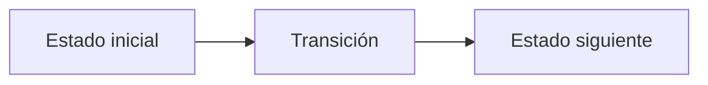

# E. Expected Snaps

**Autor:** [Autor del problema]

**Link:** [E. Expected Snaps](https://codeforces.com/gym/106710/problem/E)

**Tiempo límite:** 1 s

**Memoria límite:** 256 MB

## Description

Thanos has an array whose length is a power of two. Before he sees it, every element is chosen independently and uniformly from the integers $1,2,\ldots,K$.

An array is sorted if it is nondecreasing. While the current array is not sorted, Thanos performs a snap:

- with probability $1/2$, he keeps the left half and discards the right half;
- with probability $1/2$, he keeps the right half and discards the left half.

All snap choices are independent of each other and of the initial array. After each snap, he checks the remaining array again. An array of length one is always sorted.

The initial length is $N=2^n$. Find the expected number of snaps, where the expectation is taken over both the random initial array and all snap choices.

## Input

The only line contains two integers $n$ and $K$ – the exponent of the initial length and the number of possible values. The value of $n$ is between 0 and 200000, inclusive, and $K$ is between 1 and 200000, inclusive.

It is guaranteed that $nK$ is at most 20000000.

## Output

Let the expected number of snaps be the rational number $p/q$, where $p$ and $q$ are coprime. Print the residue modulo 998244353 of the product of $p$ and $q^{-1}$, where $q^{-1}$ is the multiplicative inverse of $q$ modulo 998244353. It is guaranteed that this inverse exists.

## Examples

### Example 1

#### Input

```text
1 2
```

#### Output

```text
748683265
```

### Example 2

#### Input

```text
0 1
```

#### Output

```text
0
```

### Example 3

#### Input

```text
4 5
```

#### Output

```text
280149939
```

## Notes

For $n=1$ and $K=2$, the only unsorted initial array is $[2,1]$. It requires one snap, so the expectation is $1/4$.

## Temas identificados

### Programación

- [Técnica o algoritmo]

### Matemáticas

- [Concepto matemático, si aplica]

## Propuesta de solución

**Autor de la propuesta:** [Autor de la propuesta]

Explica cómo modelar el problema y por qué la estrategia funciona.

## Observaciones

- [Observación clave del problema]

## Restricciones

[Relaciona los límites de entrada con la complejidad necesaria y justifica las
estructuras de datos elegidas.]

## Estados o estructura de la solución

[Define los estados, variables o estructuras principales. Si es programación
dinámica, explica qué representa cada estado y sus transiciones.]


## Casos base

[Indica los casos base y explica por qué son correctos.]

## Transiciones o algoritmo

[Explica paso a paso la transición entre estados o el algoritmo general.]



## Correctitud

[Argumenta por qué el algoritmo genera todas las soluciones válidas y no
cuenta ninguna solución más de una vez.]

## Complejidad computacional

- Tiempo: $O(?)$
- Memoria: $O(?)$

## Implementación

### C++

**Autor de la implementación:** [Autor de la implementación]

```cpp
// Código de la solución.
```

## Casos límite

- [Caso límite y resultado esperado]
- [Caso límite relacionado con las restricciones]
