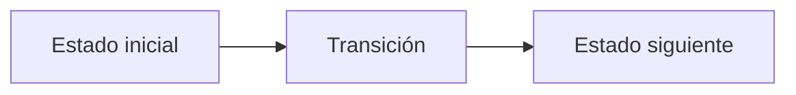

# F. Following the Mentor

**Autor:** [Autor del problema]

**Link:** [F. Following the Mentor](https://codeforces.com/gym/106710/problem/F)

**Tiempo límite:** 2 s

**Memoria límite:** 256 MB

## Description

The training committee keeps its $n$ contestants in a single mentoring tree. Contestant $1$ is the head coach, and every other contestant $i$ is mentored by exactly one contestant $p_i$. Contestant $i$ has solved $a_i$ problems so far.

The team of a contestant $u$ is $u$ together with everybody whose chain of mentors passes through $u$: the contestants mentored by $u$, the ones mentored by those, and so on. Every contestant belongs to their own team.

The season is long and the committee keeps rearranging the tree. There are $q$ events, each of one of four kinds.

- $1\ u\ v$: contestant $u$ is reassigned to be mentored by contestant $v$, and the whole team of $u$ moves along. If $v$ belongs to the team of $u$, the reassignment would put a contestant above their own mentor, so the committee rejects the request and nothing changes; the same happens when $u$ and $v$ are the same contestant.
- $2\ u\ x$: every member of the team of $u$ solves $x$ additional problems.
- $3\ u$: report how many problems the team of $u$ has solved in total.
- $4\ u$: the mentoring distance of a member $w$ of the team of $u$ is the number of mentoring links that lead from $w$ up to $u$. Report the sum of the mentoring distances of every member of the team of $u$.

In the last two events $u$ counts as a member of its own team, contributing $a_u$ problems and a mentoring distance of $0$.

## Input

The first line contains two integers $n$ and $q$ ($1 \le n \le 10^5$, $1 \le q \le 10^5$) — the number of contestants and the number of events.

The second line contains $n$ integers $a_1,a_2,\ldots,a_n$ ($1 \le a_i \le 10^6$) — the problems each contestant has already solved.

The third line contains $n-1$ integers $p_2,p_3,\ldots,p_n$ ($1 \le p_i \le n$) — the mentor of each contestant other than the head coach. The mentoring links form a rooted tree: following mentors from any contestant reaches contestant $1$. A mentor may have a larger index than the contestant they mentor. This line is empty when $n = 1$.

Each of the next $q$ lines describes one event and starts with its kind.

- 1 u v ($1 \le u,v \le n$) — reassign contestant $u$ to mentor $v$.
- 2 u x ($1 \le u \le n$, $1 \le x \le 10^6$) — everyone in the team of $u$ solves $x$ more problems.
- 3 u ($1 \le u \le n$) — total problems solved by the team of $u$.
- 4 u ($1 \le u \le n$) — total mentoring distance inside the team of $u$.

## Output

For every event of kind $3$ or $4$, print one line with the requested value, in the same order as the events appear in the input.

The answers can exceed $2^{31}$. They are compared as a sequence of integers.

## Examples

### Example 1

#### Input

```text
7 6
10 20 30 40 50 60 70
1 1 1 2 2 4
3 2
4 1
2 2 5
3 2
1 2 4
4 1
```

#### Output

```text
130
9
145
12
```

### Example 2

#### Input

```text
5 6
1 2 3 4 5
1 1 2 2
1 2 5
4 1
2 2 10
3 1
1 2 3
4 1
```

#### Output

```text
6
45
9
```

### Example 3

#### Input

```text
3 4
5 5 5
1 2
4 1
1 3 1
4 1
3 3
```

#### Output

```text
3
2
5
```

## Temas identificados

### Programación

- [Técnica o algoritmo]

### Matemáticas

- [Concepto matemático, si aplica]

## Propuesta de solución

**Autor de la propuesta:** [Autor de la propuesta]

Explica cómo modelar el problema y por qué la estrategia funciona.

## Observaciones

- [Observación clave del problema]

## Restricciones

[Relaciona los límites de entrada con la complejidad necesaria y justifica las
estructuras de datos elegidas.]

## Estados o estructura de la solución

[Define los estados, variables o estructuras principales. Si es programación
dinámica, explica qué representa cada estado y sus transiciones.]


## Casos base

[Indica los casos base y explica por qué son correctos.]

## Transiciones o algoritmo

[Explica paso a paso la transición entre estados o el algoritmo general.]



## Correctitud

[Argumenta por qué el algoritmo genera todas las soluciones válidas y no
cuenta ninguna solución más de una vez.]

## Complejidad computacional

- Tiempo: $O(?)$
- Memoria: $O(?)$

## Implementación

### C++

**Autor de la implementación:** [Autor de la implementación]

```cpp
// Código de la solución.
```

## Casos límite

- [Caso límite y resultado esperado]
- [Caso límite relacionado con las restricciones]
