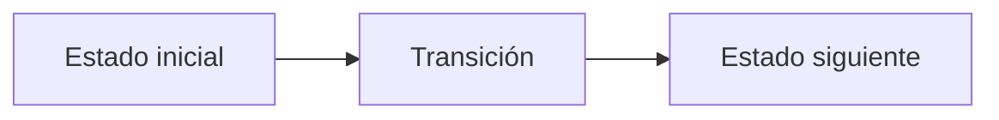

# G. Grand Rainbow Railway

**Autor:** [Autor del problema]

**Link:** [G. Grand Rainbow Railway](https://codeforces.com/gym/106710/problem/G)

**Tiempo límite:** 3 s

**Memoria límite:** 256 MB

## Description

There are $n$ cities and $m$ proposed undirected railway tracks. The cities are numbered from $1$ to $n$, and the tracks are numbered from $1$ to $m$ in input order. Each track has one of $n-1$ permit colors, numbered from $1$ to $n-1$.

Choose exactly $n-1$ distinct tracks such that they form a spanning tree and every permit color is used exactly once. A spanning tree is a connected, acyclic graph containing all $n$ cities.

## Input

The first line contains two integers $n$ and $m$ ($2 \le n \le 120$, $n-1 \le m \le 2500$).

Each of the next $m$ lines contains three integers $u$, $v$, and $c$ ($1 \le u,v \le n$, $u \ne v$, $1 \le c \lt n$), describing an undirected track between cities $u$ and $v$ with permit color $c$.

Parallel tracks are allowed, even with the same endpoints, provided that no two input lines describe the same unordered pair of endpoints with the same color. Every color from $1$ to $n-1$ occurs in at least one track.

## Output

If no valid selection exists, print $-1$.

Otherwise, print $n-1$ distinct integers: the indices of tracks in any valid selection, in any order. Any valid answer is accepted.

## Examples

### Example 1

#### Input

```text
4 5
1 2 1
2 3 2
3 4 3
1 3 1
2 4 2
```

#### Output

```text
1 2 3
```

## Notes

The selected tracks must satisfy both requirements simultaneously: they must connect all cities without a cycle, and their colors must be pairwise distinct. Because there are exactly $n-1$ selected tracks and exactly $n-1$ colors, pairwise distinct colors are equivalent to using every color exactly once.

## Temas identificados

### Programación

- [Técnica o algoritmo]

### Matemáticas

- [Concepto matemático, si aplica]

## Propuesta de solución

**Autor de la propuesta:** [Autor de la propuesta]

Explica cómo modelar el problema y por qué la estrategia funciona.

## Observaciones

- [Observación clave del problema]

## Restricciones

[Relaciona los límites de entrada con la complejidad necesaria y justifica las
estructuras de datos elegidas.]

## Estados o estructura de la solución

[Define los estados, variables o estructuras principales. Si es programación
dinámica, explica qué representa cada estado y sus transiciones.]


## Casos base

[Indica los casos base y explica por qué son correctos.]

## Transiciones o algoritmo

[Explica paso a paso la transición entre estados o el algoritmo general.]



## Correctitud

[Argumenta por qué el algoritmo genera todas las soluciones válidas y no
cuenta ninguna solución más de una vez.]

## Complejidad computacional

- Tiempo: $O(?)$
- Memoria: $O(?)$

## Implementación

### C++

**Autor de la implementación:** [Autor de la implementación]

```cpp
// Código de la solución.
```

## Casos límite

- [Caso límite y resultado esperado]
- [Caso límite relacionado con las restricciones]
