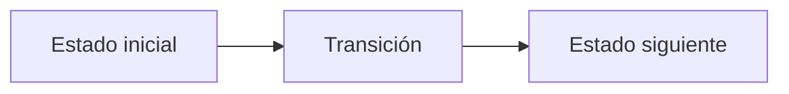

# H. Hlaalu's Ebony

**Autor:** [Autor del problema]

**Link:** [H. Hlaalu's Ebony](https://codeforces.com/gym/106710/problem/H)

**Tiempo límite:** 1 s

**Memoria límite:** 256 MB

## Description

Word has reached House Hlaalu of a merchant blessed with a satchel of Almsivi Intervention scrolls — the Tribunal's gift that lets one step instantly to the nearest temple anywhere on Vvardenfell. No longer bound to the silt strider's fixed path, the merchant may appear at any settlement, in any order, to trade raw ebony.

At each of the $N$ settlements, the price of raw ebony is known. The merchant will buy one unit at a settlement and sell it at a (possibly identical) settlement. Since travel order is unrestricted, the maximum profit is the largest selling price minus the smallest buying price. If all prices are equal, the answer is $0$.

Given the prices at all $N$ settlements, determine the maximum profit the merchant can achieve.

## Input

The first line contains a single integer $N$ $(2 \le N \le 2 \cdot 10^5)$, the number of settlements on Vvardenfell where raw ebony is traded.

The second line contains $N$ integers $p_1, p_2, \ldots, p_N$ $(1 \le p_i \le 10^9)$, where $p_i$ is the price of one unit of raw ebony at the $i$-th settlement.

## Output

Print a single integer: the maximum profit the merchant can achieve.

## Examples

### Example 1

#### Input

```text
5
7 1 5 3 6
```

#### Output

```text
6
```

### Example 2

#### Input

```text
3
10 10 10
```

#### Output

```text
0
```

## Temas identificados

### Programación

- [Técnica o algoritmo]

### Matemáticas

- [Concepto matemático, si aplica]

## Propuesta de solución

**Autor de la propuesta:** [Autor de la propuesta]

Explica cómo modelar el problema y por qué la estrategia funciona.

## Observaciones

- [Observación clave del problema]

## Restricciones

[Relaciona los límites de entrada con la complejidad necesaria y justifica las
estructuras de datos elegidas.]

## Estados o estructura de la solución

[Define los estados, variables o estructuras principales. Si es programación
dinámica, explica qué representa cada estado y sus transiciones.]


## Casos base

[Indica los casos base y explica por qué son correctos.]

## Transiciones o algoritmo

[Explica paso a paso la transición entre estados o el algoritmo general.]



## Correctitud

[Argumenta por qué el algoritmo genera todas las soluciones válidas y no
cuenta ninguna solución más de una vez.]

## Complejidad computacional

- Tiempo: $O(?)$
- Memoria: $O(?)$

## Implementación

### C++

**Autor de la implementación:** [Autor de la implementación]

```cpp
// Código de la solución.
```

## Casos límite

- [Caso límite y resultado esperado]
- [Caso límite relacionado con las restricciones]
