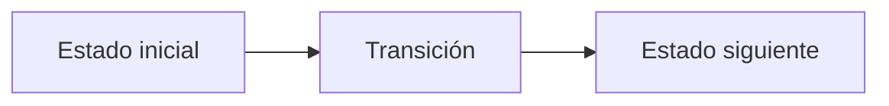

# I. Inner Product II

**Autor:** [Autor del problema]

**Link:** [I. Inner Product II](https://codeforces.com/gym/106710/problem/I)

**Tiempo límite:** 0.5 s

**Memoria límite:** 256 MB

## Description

You are given a tree with $n$ vertices. Vertex $i$ has a positive integer weight $a_i$.

You want to choose positive integers $b_1, b_2, \dots, b_n$.

Each edge of the tree contains one of the characters <, =, or >. If an edge is written as $u\ v\ c$, then:

- if $c \text{ is equal to } \lt $, you must have $b_u \lt b_v$;
- if $c \text{ is equal to } =$, you must have $b_u = b_v$;
- if $c \text{ is equal to } \gt $, you must have $b_u \gt b_v$.

Among all valid assignments, minimize $$ a_1 b_1 + a_2 b_2 + \dots + a_n b_n. $$

For the given constraints, it can be proved that the optimal assignment is unique.

## Input

The first line contains one integer $n$ ($2 \le n \le 200'000$).

The second line contains $n$ integers $a_1, a_2, \dots, a_n$ ($1 \le a_i \le 1'000'000$).

Each of the next $n - 1$ lines contains two integers $u_i$, $v_i$ and one character $c_i$ ($1 \le u_i, v_i \le n$, $u_i \ne v_i$, $c_i$ is one of <, =, >), meaning that the tree contains an edge between $u_i$ and $v_i$, and the required relation is $b_{u_i}\ c_i\ b_{v_i}$.

## Output

Print the minimum possible value of $$ a_1 b_1 + a_2 b_2 + \dots + a_n b_n $$ in the first line.

In the second line, print the unique optimal assignment $b_1, b_2, \dots, b_n$.

It can be proved that, for the given constraints, the minimum value always fits in a signed $64$-bit integer.

## Examples

### Example 1

#### Input

```text
6
5 1 4 3 2 6
1 2 <
2 3 >
2 4 <
4 5 =
4 6 >
```

#### Output

```text
32
1 2 1 3 3 1
```

### Example 2

#### Input

```text
7
9 2 8 1 7 3 6
1 2 =
2 3 <
3 4 >
2 5 =
5 6 <
5 7 >
```

#### Output

```text
76
2 2 3 1 2 3 1
```

## Notes

The first sample requires:

- $b_1 \lt b_2$,
- $b_2 \gt b_3$,
- $b_2 \lt b_4$,
- $b_4 = b_5$,
- $b_4 \gt b_6$.

One optimal assignment is $1\ 2\ 1\ 3\ 3\ 1$, and its cost is $$ 5 \cdot 1 + 1 \cdot 2 + 4 \cdot 1 + 3 \cdot 3 + 2 \cdot 3 + 6 \cdot 1 = 32. $$

## Temas identificados

### Programación

- [Técnica o algoritmo]

### Matemáticas

- [Concepto matemático, si aplica]

## Propuesta de solución

**Autor de la propuesta:** [Autor de la propuesta]

Explica cómo modelar el problema y por qué la estrategia funciona.

## Observaciones

- [Observación clave del problema]

## Restricciones

[Relaciona los límites de entrada con la complejidad necesaria y justifica las
estructuras de datos elegidas.]

## Estados o estructura de la solución

[Define los estados, variables o estructuras principales. Si es programación
dinámica, explica qué representa cada estado y sus transiciones.]


## Casos base

[Indica los casos base y explica por qué son correctos.]

## Transiciones o algoritmo

[Explica paso a paso la transición entre estados o el algoritmo general.]



## Correctitud

[Argumenta por qué el algoritmo genera todas las soluciones válidas y no
cuenta ninguna solución más de una vez.]

## Complejidad computacional

- Tiempo: $O(?)$
- Memoria: $O(?)$

## Implementación

### C++

**Autor de la implementación:** [Autor de la implementación]

```cpp
// Código de la solución.
```

## Casos límite

- [Caso límite y resultado esperado]
- [Caso límite relacionado con las restricciones]
