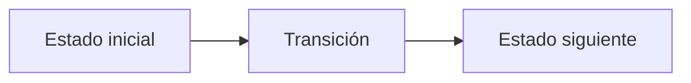

# J. Jalisco's Hydration Stations

**Autor:** [Autor del problema]

**Link:** [J. Jalisco's Hydration Stations](https://codeforces.com/gym/106710/problem/J)

**Tiempo límite:** 3 s

**Memoria límite:** 256 MB

## Description

Etienne and Christian are organizing a Sunday event along Avenida Vallarta, modeled as a straight line. Participant $i$ waits at coordinate $x_i$.

They must place exactly $k$ hydration stations. Each station may be placed at any real coordinate, and multiple stations may be placed at the same coordinate. After the stations are placed, each participant walks to a station minimizing the absolute distance from their position. If several stations are equally near, choosing any of them gives the same walking distance.

Find the minimum possible sum of the walking distances of all participants.

## Input

The first line contains two integers $n$ and $k$ ($1 \le k \le n \le 100000$, $k \le 25$).

The second line contains $n$ integers $x_1,x_2,\ldots,x_n$ ($0 \le x_1 \le x_2 \le \cdots \le x_n \le 10^9$). Equal coordinates are allowed.

## Output

Print one integer: the minimum possible total walking distance.

Although station coordinates may be real numbers, an optimal solution can place every station at a participant coordinate, so the answer is an integer. The answer fits in a signed 64-bit integer but may exceed the 32-bit range.

## Examples

### Example 1

#### Input

```text
6 3
0 2 3 10 11 20
```

#### Output

```text
4
```

## Notes

In the sample, stations can be placed at coordinates $2$, $10$, and $20$. The walking distances are $2,0,1,0,1,0$, for a total of $4$.

Requiring exactly $k$ stations never increases the optimum: any redundant station may be placed at the same coordinate as another station.

## Temas identificados

### Programación

- [Técnica o algoritmo]

### Matemáticas

- [Concepto matemático, si aplica]

## Propuesta de solución

**Autor de la propuesta:** [Autor de la propuesta]

Explica cómo modelar el problema y por qué la estrategia funciona.

## Observaciones

- [Observación clave del problema]

## Restricciones

[Relaciona los límites de entrada con la complejidad necesaria y justifica las
estructuras de datos elegidas.]

## Estados o estructura de la solución

[Define los estados, variables o estructuras principales. Si es programación
dinámica, explica qué representa cada estado y sus transiciones.]


## Casos base

[Indica los casos base y explica por qué son correctos.]

## Transiciones o algoritmo

[Explica paso a paso la transición entre estados o el algoritmo general.]



## Correctitud

[Argumenta por qué el algoritmo genera todas las soluciones válidas y no
cuenta ninguna solución más de una vez.]

## Complejidad computacional

- Tiempo: $O(?)$
- Memoria: $O(?)$

## Implementación

### C++

**Autor de la implementación:** [Autor de la implementación]

```cpp
// Código de la solución.
```

## Casos límite

- [Caso límite y resultado esperado]
- [Caso límite relacionado con las restricciones]
