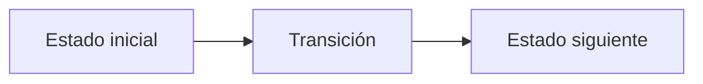

# K. Kaleidoscopic Talavera

**Autor:** [Autor del problema]

**Link:** [K. Kaleidoscopic Talavera](https://codeforces.com/gym/106710/problem/K)

**Tiempo límite:** 3 s

**Memoria límite:** 256 MB

## Description

An artisan paints a mural using $n$ axis-aligned rectangular stencils. Rectangle $i$ is the half-open set $[x_{1,i},x_{2,i}) \times [y_{1,i},y_{2,i})$. Rectangles may overlap, share boundary segments, or coincide.

A point is covered exactly once if it belongs to exactly one rectangle. The union consists of all points covered by at least one rectangle. Its perimeter is the total length of the boundary separating covered points from uncovered points; shared boundaries inside the union do not contribute.

Find (1) the area covered exactly once and (2) the perimeter of the union.

## Input

The first line contains an integer $n$ ($1 \le n \le 200000$).

Each of the next $n$ lines contains four integers $x_1$, $y_1$, $x_2$, and $y_2$ describing one rectangle ($-10^9 \le x_1 \lt x_2 \le 10^9$ and $-10^9 \le y_1 \lt y_2 \le 10^9$).

## Output

Print two integers: the total area covered by exactly one rectangle and the perimeter of the union, in that order.

Both values fit in a signed 64-bit integer but may exceed the signed 32-bit range.

## Examples

### Example 1

#### Input

```text
2
0 0 2 2
1 0 3 1
```

#### Output

```text
4 10
```

## Notes

Rectangles are half-open only to make point membership unambiguous. Changing which rectangle owns a shared boundary does not change either requested value. Use 64-bit integer arithmetic.

## Temas identificados

### Programación

- [Técnica o algoritmo]

### Matemáticas

- [Concepto matemático, si aplica]

## Propuesta de solución

**Autor de la propuesta:** [Autor de la propuesta]

Explica cómo modelar el problema y por qué la estrategia funciona.

## Observaciones

- [Observación clave del problema]

## Restricciones

[Relaciona los límites de entrada con la complejidad necesaria y justifica las
estructuras de datos elegidas.]

## Estados o estructura de la solución

[Define los estados, variables o estructuras principales. Si es programación
dinámica, explica qué representa cada estado y sus transiciones.]


## Casos base

[Indica los casos base y explica por qué son correctos.]

## Transiciones o algoritmo

[Explica paso a paso la transición entre estados o el algoritmo general.]



## Correctitud

[Argumenta por qué el algoritmo genera todas las soluciones válidas y no
cuenta ninguna solución más de una vez.]

## Complejidad computacional

- Tiempo: $O(?)$
- Memoria: $O(?)$

## Implementación

### C++

**Autor de la implementación:** [Autor de la implementación]

```cpp
// Código de la solución.
```

## Casos límite

- [Caso límite y resultado esperado]
- [Caso límite relacionado con las restricciones]
