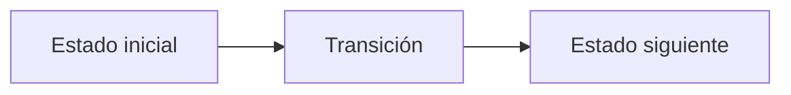

# L. Ledger of true names

**Autor:** [Autor del problema]

**Link:** [L. Ledger of true names](https://codeforces.com/gym/106710/problem/L)

**Tiempo límite:** 1 s

**Memoria límite:** 256 MB

## Description

In the ruined observatory above the dead city, Racso and Christian copy out the Ledger of True Names.

A true name is power: speak one and the thing it belongs to must answer. But a name spoken alone burns the speaker, so the old sorcerers bound names in pairs, sealing each pair under a single sigil. The binding holds only if the two names begin the same way, and the sigil's power is exactly the length of that shared beginning.

The brothers have $N$ true names before them and one night of candlelight. Find the power of the strongest sigil they can seal — the longest beginning shared by two different names in the Ledger.

## Input

The first line contains a single integer $N$ $(2 \le N \le 10^5)$ — the number of true names in the Ledger.

Each of the next $N$ lines contains one true name $s_i$, a non-empty string of lowercase Latin letters with $|s_i| \le 50$.

It is guaranteed that the sum of $|s_i|$ over all names does not exceed $10^5$. Names are not necessarily distinct.

## Output

Print a single integer: the power of the strongest sigil, or $0$ if no two names in the Ledger even begin with the same letter.

## Examples

### Example 1

#### Input

```text
5
racso
rascal
christian
christ
chris
```

#### Output

```text
6
```

### Example 2

#### Input

```text
3
umbra
umbra
sol
```

#### Output

```text
5
```

## Notes

Two names $s$ and $t$ share a beginning of length $\ell$ if $s_1 = t_1$, $s_2 = t_2$, $\ldots$, $s_\ell = t_\ell$.

Two entries of the Ledger are always considered different if they sit at different positions in the input, even when their names are identical: two entries reading umbra share a beginning of length $5$.

## Temas identificados

### Programación

- [Técnica o algoritmo]

### Matemáticas

- [Concepto matemático, si aplica]

## Propuesta de solución

**Autor de la propuesta:** [Autor de la propuesta]

Explica cómo modelar el problema y por qué la estrategia funciona.

## Observaciones

- [Observación clave del problema]

## Restricciones

[Relaciona los límites de entrada con la complejidad necesaria y justifica las
estructuras de datos elegidas.]

## Estados o estructura de la solución

[Define los estados, variables o estructuras principales. Si es programación
dinámica, explica qué representa cada estado y sus transiciones.]


## Casos base

[Indica los casos base y explica por qué son correctos.]

## Transiciones o algoritmo

[Explica paso a paso la transición entre estados o el algoritmo general.]



## Correctitud

[Argumenta por qué el algoritmo genera todas las soluciones válidas y no
cuenta ninguna solución más de una vez.]

## Complejidad computacional

- Tiempo: $O(?)$
- Memoria: $O(?)$

## Implementación

### C++

**Autor de la implementación:** [Autor de la implementación]

```cpp
// Código de la solución.
```

## Casos límite

- [Caso límite y resultado esperado]
- [Caso límite relacionado con las restricciones]
