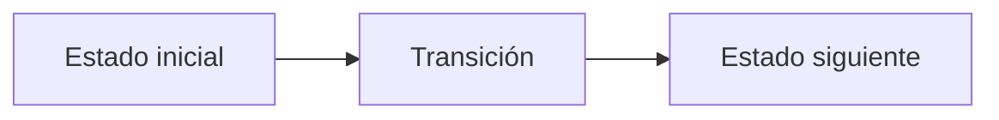

# M. Miguel and His Chess Tournament

**Autor:** [Autor del problema]

**Link:** [M. Miguel and His Chess Tournament](https://codeforces.com/gym/106710/problem/M)

**Tiempo límite:** 0.5 s

**Memoria límite:** 256 MB

## Description

Miguel organized a chess tournament with $n$ participants numbered from $1$ to $n$. Every pair played exactly one game. Every game ended with one winner and one loser; there were no draws.

Everything was going well until the software recording the results broke down. The individual game results disappeared, and only a table of totals could be recovered: according to it, participant $i$ earned exactly $b_i$ victories.

Miguel and the participants do not trust this table. If the program lost the games, who can guarantee that the totals were not corrupted too? Before announcing the winner, Miguel wants to know whether those numbers could describe a tournament like the one they organized.

Determine whether there is a set of game results consistent with the recovered totals. If there is, reconstruct one. You do not need to recover the original games: any reconstruction in which each participant $i$ won exactly $b_i$ times is acceptable.

## Input

The first line contains an integer $n$ ($1\le n\le2000$).

The second line contains $n$ integers $b_1,b_2,\ldots,b_n$ ($0\le b_i\le n-1$): the recorded number of victories for each participant.

## Output

If no valid reconstruction exists, print NO.

Otherwise, print YES, followed by $n$ lines, each containing a string of exactly $n$ characters, all either 0 or 1, without spaces. These strings form a matrix $A$, where $A_{i,j}=1$ means that participant $i$ defeated participant $j$.

The matrix must satisfy $A_{i,i}=0$, $A_{i,j}+A_{j,i}=1$ for all $i\ne j$, and $\sum_{j=1}^{n}A_{i,j}=b_i$ for every $i$. If several valid reconstructions exist, print any of them.

## Examples

### Example 1

#### Input

```text
4
0 0 3 3
```

#### Output

```text
NO
```

### Example 2

#### Input

```text
1
0
```

#### Output

```text
YES
0
```

### Example 3

#### Input

```text
3
2 0 1
```

#### Output

```text
YES
011
000
010
```

## Temas identificados

### Programación

- [Técnica o algoritmo]

### Matemáticas

- [Concepto matemático, si aplica]

## Propuesta de solución

**Autor de la propuesta:** [Autor de la propuesta]

Explica cómo modelar el problema y por qué la estrategia funciona.

## Observaciones

- [Observación clave del problema]

## Restricciones

[Relaciona los límites de entrada con la complejidad necesaria y justifica las
estructuras de datos elegidas.]

## Estados o estructura de la solución

[Define los estados, variables o estructuras principales. Si es programación
dinámica, explica qué representa cada estado y sus transiciones.]


## Casos base

[Indica los casos base y explica por qué son correctos.]

## Transiciones o algoritmo

[Explica paso a paso la transición entre estados o el algoritmo general.]



## Correctitud

[Argumenta por qué el algoritmo genera todas las soluciones válidas y no
cuenta ninguna solución más de una vez.]

## Complejidad computacional

- Tiempo: $O(?)$
- Memoria: $O(?)$

## Implementación

### C++

**Autor de la implementación:** [Autor de la implementación]

```cpp
// Código de la solución.
```

## Casos límite

- [Caso límite y resultado esperado]
- [Caso límite relacionado con las restricciones]
