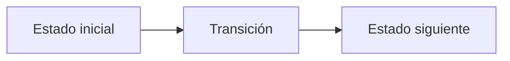

# N. Nord's Cairn

**Autor:** [Autor del problema]

**Link:** [N. Nord's Cairn](https://codeforces.com/gym/106710/problem/N)

**Tiempo límite:** 1 s

**Memoria límite:** 256 MB

## Description

Deep beneath the frost of Hjaalmarch, the excavation at Ustengrav has unearthed the collapsed remains of ancient Nord burial cairns — stone monuments the old draugr-lords raised over their fallen thanes.

The Nords built every cairn the same way: the topmost layer holds a single stone, and each layer beneath it holds exactly one stone more than the layer above. A pile of stones is called cairn-perfect if its stones can be arranged into such a cairn, using every stone and leaving no layer unfinished. Equivalently, a positive integer is cairn-perfect exactly when it is a triangular number $$T_k=1+2+\cdots+k=\frac{k(k+1)}{2}$$ for some integer $k\ge 1$.

Urag gro-Shub, keeper of the Arcanaeum at the College of Winterhold, has grown impatient with the excavation ledgers. The diggers record only the number of stones in each rubble heap, never its shape, and Urag will authorise no further shipment until he knows how many of the recorded counts could possibly have been complete cairns.

Given two integers $L$ and $R$, determine how many integers $n$ with $L \le n \le R$ are cairn-perfect.

## Input

The single line of input contains two integers $L$ and $R$ $(1 \le L \lt R \le 10^{12})$, the smallest and largest stone-counts recorded in the excavation ledger. Both bounds are inclusive.

## Output

Print a single integer: the number of cairn-perfect stone-counts in the ledger's range.

## Examples

### Example 1

#### Input

```text
1 10
```

#### Output

```text
4
```

### Example 2

#### Input

```text
6 9
```

#### Output

```text
1
```

## Temas identificados

### Programación

- [Técnica o algoritmo]

### Matemáticas

- [Concepto matemático, si aplica]

## Propuesta de solución

**Autor de la propuesta:** [Autor de la propuesta]

Explica cómo modelar el problema y por qué la estrategia funciona.

## Observaciones

- [Observación clave del problema]

## Restricciones

[Relaciona los límites de entrada con la complejidad necesaria y justifica las
estructuras de datos elegidas.]

## Estados o estructura de la solución

[Define los estados, variables o estructuras principales. Si es programación
dinámica, explica qué representa cada estado y sus transiciones.]


## Casos base

[Indica los casos base y explica por qué son correctos.]

## Transiciones o algoritmo

[Explica paso a paso la transición entre estados o el algoritmo general.]



## Correctitud

[Argumenta por qué el algoritmo genera todas las soluciones válidas y no
cuenta ninguna solución más de una vez.]

## Complejidad computacional

- Tiempo: $O(?)$
- Memoria: $O(?)$

## Implementación

### C++

**Autor de la implementación:** [Autor de la implementación]

```cpp
// Código de la solución.
```

## Casos límite

- [Caso límite y resultado esperado]
- [Caso límite relacionado con las restricciones]
